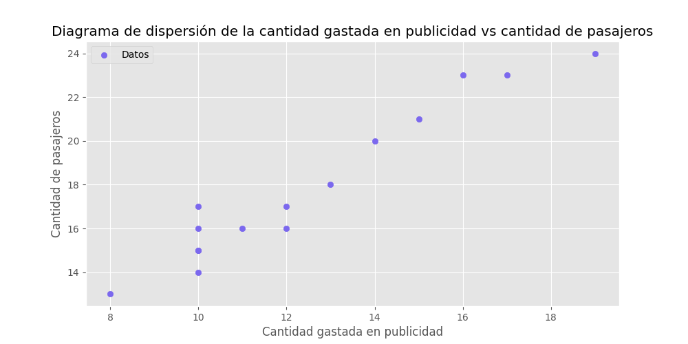
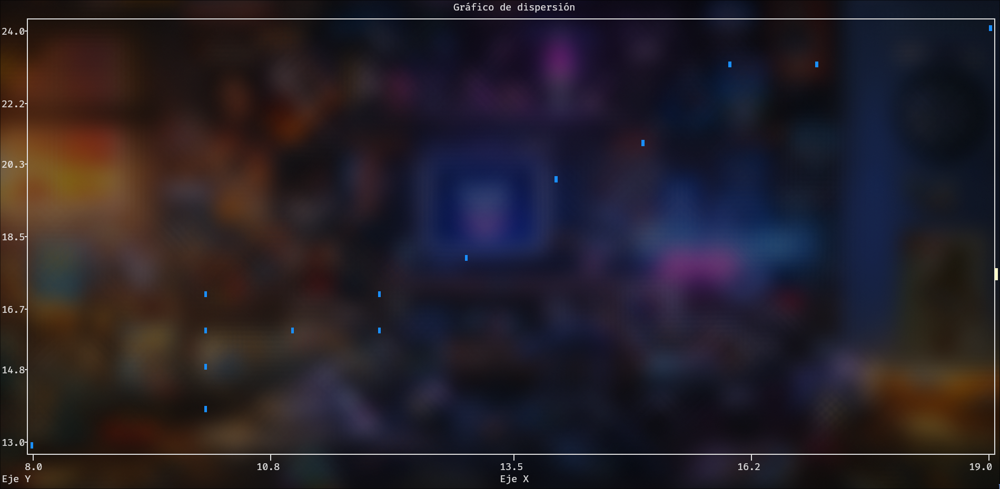
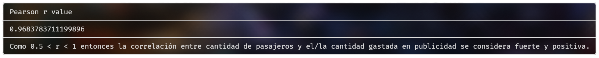

# Proyecto de Análisis y Visualización de Datos

# Tabla de Contenidos

1. [Descripción](#descripción)
2. [Funcionalidades](#funcionalidades)
3. [Archivos principales](#archivos-principales)
4. [Requisitos](#requisitos)
   - [Dependencias](#dependencias)
5. [Instalación y Configuración del Entorno Virtual](#instalación-y-configuración-del-entorno-virtual)
6. [Uso](#uso)
7. [Screenshots](#screenshots) 
7. [Notas Adicionales](#notas-adicionales)
8. [Contribuciones](#contribuciones)

## Descripción

Este repositorio contiene algunos scripts en Python que permiten calcular la correlación entre dos conjuntos de datos, generar gráficos de dispersión y presentar los resultados en una tabla formateada en la terminal o en un .png.

## Funcionalidades

- **Cálculo de correlación:**
  Ahora solo permite calcular la correlación mediante Pearson.
  - **Pearson:** Para datos continuos y normalmente distribuidos.

- **Visualización de datos:**
  - **Gráficos con Matplotlib:** Genera gráficos de dispersión con estilo `dark_background`.
  - **Salida ASCII (opcional):** Muestra el gráfico en la terminal utilizando `plotext` si se activa la opción correspondiente.

- **Presentación de resultados:**
  Los resultados, como el coeficiente de correlación, se muestran en una tabla formateada usando la librería `rich`.

## Archivos principales

- **main.py:** Script principal que integra la lectura de datos, generación de gráficos, cálculo de correlación y visualización de resultados en una tabla.

- **coeficiente_correlacion.py:** Implementa la función para calcular la correlación entre dos arreglos usando el método de Pearson.

- **graphic.py:** Contiene funciones para crear gráficos de dispersión tanto en formato gráfico como en ASCII.

- **table.py:** Incluye la función para mostrar resultados y conclusión del coeficiente en una tabla formateada en la terminal usando `rich`.

## Requisitos

- Python 3.6 o superior.

### Dependencias

El proyecto utiliza las siguientes librerías:
- matplotlib
- numpy
- scipy
- rich
- plotext (opcional, para salida en ASCII)

## Instalación y Configuración del Entorno Virtual

1. **Clonar el repositorio:**

```bash
 git clone https://github.com/m0r4a/correlation.git
 cd correlation
```

2. **Crear y activar un entorno virtual:**

En Unix/macOS
```bash
python3 -m venv venv
source venv/bin/activate
```

En Windows
```bash
python -m venv venv
venv\Scripts\activate
```

3. **Instalar las dependencias:**

```bash
pip install -r requirements.txt
```

## Uso

1. **Definir datos:**

En el archivo main.py se definen dos arreglos de datos (arr1 para X y arr2 para Y). Puedes reemplazar los valores de ejemplo con tus propios datos.

Opcionalmente le puedes pasar el nombre de las variables que hayas declarado a la función de calcular la correlación para que te de una mejor conclusión.

Ejecutar el script principal:

```bash
python main.py
```

Al ejecutar el script se realizarán las siguientes acciones:

- Se calculará la correlación entre los datos mediante la función `calcular_coeficiente_correlacion` (definia en `coeficiente_correlacion.py`).

- Se mostrará el coeficiente de correlación y su conclusión en una tabla formateada en la terminal utilizando la función `table` (definida en `table.py`).

- Se generará un gráfico de dispersión de los datos utilizando la función `graphic` (definida en `graphic.py`).

## Screenshots

### Gráfico de dispersión: Imagen

<p align="center">
    
</p>

### Gráfico de dispersión: ASCII

<p align="center">
    
</p>

### Tabla para el valor r

<p align="center">
    
</p>

## Notas adicionales

- **Salida ASCII:** Si quieres ver el gráfico en ASCII necesitas tener instalado `plotext`, está includo en `requirements.txt`

- **Modularidad:** El código está estructurado de forma modular así que debería ser mas o menos sencillo agregarle más funcionalidades.

## Contribuciones

Aunque es sencillo **extender** la funcionalidad del código preferiría que no hagan PRs agregando funciones, solo corrigiendo o mejorando el código, este código será de un solo uso así que realmente no me interesa tener más funciones.
